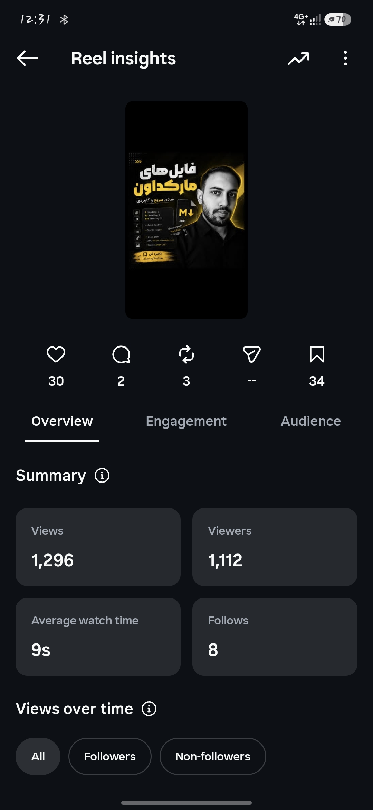
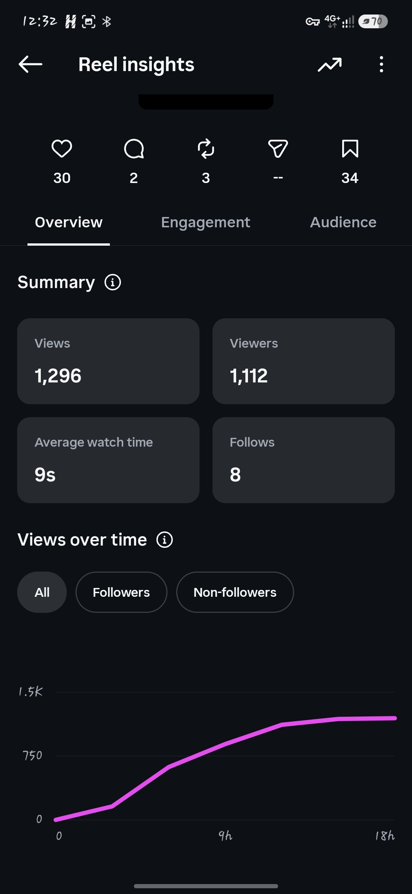
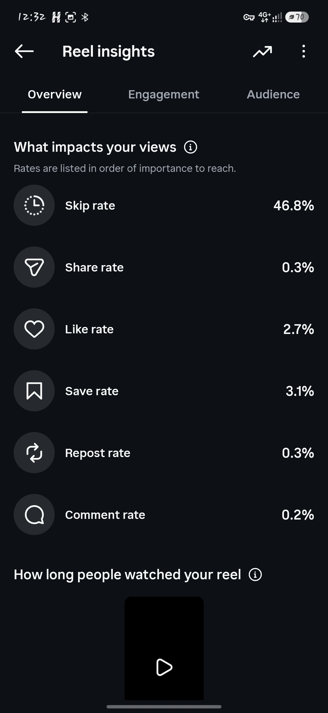
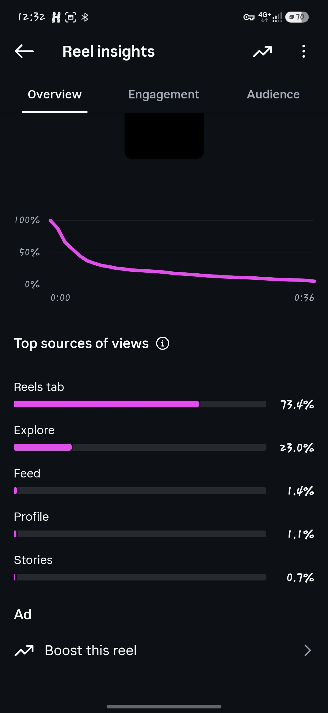
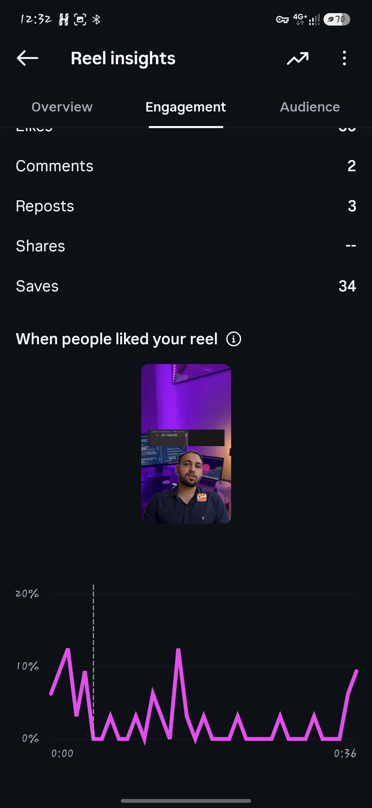
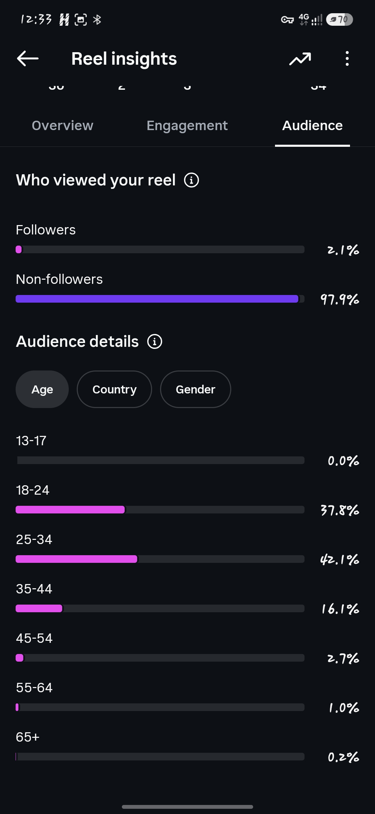

داداش، این اسکرین‌شات‌ها خیلی بیشتر از قبلی به ما اطلاعات میدن. الان می‌تونیم واقعاً بر اساس داده تصمیم بگیریم، نه حدس. 🔥

اول: Reel اولت واقعاً بد نبوده

بعد از حدود یک روز:

👀 1,296 Views

👤 1,112 نفر بیننده

❤️ 30 Like → 2.7%

🔖 34 Save → 3.1%

🔄 3 Repost → 0.3%

💬 2 Comment → 0.2%

➕ 8 Follow

⏱️ Average watch: 9 ثانیه

Skip rate: 46.8%

و مهم‌تر از همه:

73.4٪ ویوها از Reels Tab
23٪ از Explore

یعنی اینستاگرام واقعاً Reel رو به آدم‌هایی غیر از فالوورها نشون داده. این برای پیج صفر فالوور خیلی مهمه.

---

اما یک مشکل واضح داریم

ویدیوت ۳۶ ثانیه بوده ولی میانگین تماشا ۹ ثانیه.

یعنی تقریباً فقط یک‌چهارم ویدیو به‌طور میانگین دیده شده.

نمودار Retention هم دقیقاً این رو تأیید می‌کنه: در چند ثانیه اول افت شدیدی داری.

پس برای Reel بعدی باید روی Hook و ۵ ثانیه اول خیلی بیشتر کار کنیم.

ولی نکته جالب اینجاست:

Save Rate = 3.1% 🔥

34 نفر ذخیره‌اش کردن.

یعنی موضوع و ارزش آموزشی محتوا خوب بوده؛ مشکل اصلی احتمالاً ارائه و Retention بوده، نه انتخاب موضوع.

---

بنابراین پست بعدی من:

🟨 Carousel Markdown

نه Reel.

چرا؟

چون الان دو چیز داریم که می‌خواهیم تست کنیم:

Reel اول:
محتوای آموزشی → Reach خوب + Save خوب

Carousel دوم:
همان حوزه → ببینیم آیا مخاطب با محتوای اسلایدی حتی بیشتر Save می‌کند یا نه.

این خیلی آزمایش تمیزی میشه.

---

⏰ ساعت انتشار

من همچنان 17:40 رو انتخاب می‌کنم.

نه به خاطر اینکه «الگوریتم ساعت 17:40 رو دوست داره» 😂

بلکه چون خودت روی همین Reel مشاهده کردی که حوالی اون زمان سرعت رشدش زیاد شده.

پس:

> پست دوم → Carousel Markdown
ساعت → 17:40

و بعد از انتشارش حداقل چند ساعت بهش دست نمی‌زنیم.

---

و یک تصمیم مهم‌تر برای Reel سوم

بعد از Carousel، دوباره Reel می‌زنیم.

ولی این بار با یک تغییر اساسی:

Reel اول:

36 ثانیه ❌
Hook نسبتاً طولانی
Average Watch = 9s

Reel سوم:

من سعی می‌کنم برسونیمش به 15–20 ثانیه.

و ساختارش:

0–2 ثانیه: یک Hook که مخاطب را نگه دارد.

2–5 ثانیه: نتیجه/چیزی که قرار است یاد بگیرد.

5–16 ثانیه: اصل محتوا.

16–20 ثانیه: پایان + CTA.

---

یک چیز خیلی امیدوارکننده هم داریم:

تو با 1,112 بیننده، 8 نفر Follow گرفتی.

یعنی آدم‌هایی که محتوایت را دیدند، فقط رد نشدند؛ بعضی‌ها گفتند این پیج ارزش دنبال کردن دارد.

پس من الان اصلاً پیشنهاد نمی‌کنم موضوع پیج رو عوض کنی یا شروع کنی دنبال ترندهای بی‌ربط بری.

مسیر فعلی رو ادامه بده.

فقط یک چیز رو بهینه کن:

> همون ارزش آموزشی → با Hook و Retention بهتر.

---

برنامه من برای ۴ پست اولت:

پست	فرمت	هدف

1	🎥 Reel Markdown	تست Reach
2	📚 Carousel Markdown	تست Save
3	🎥 Reel آموزشی	تست Retention
4	📚 Carousel	تست Share/Save

بعد از پست چهارم، دیگه می‌تونیم با داده واقعی خود Tavoos.Dev تصمیم بگیریم که کدوم فرمت باید سهم بیشتری از محتوای پیجت داشته باشه.

فعلاً من پست دوم رو قطعاً Carousel می‌زنم. و 17:40 هم انتخاب خوبی برای آزمایش بعدیه. 🔥