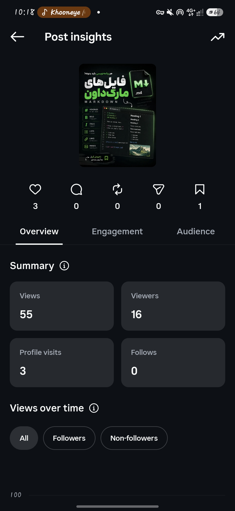
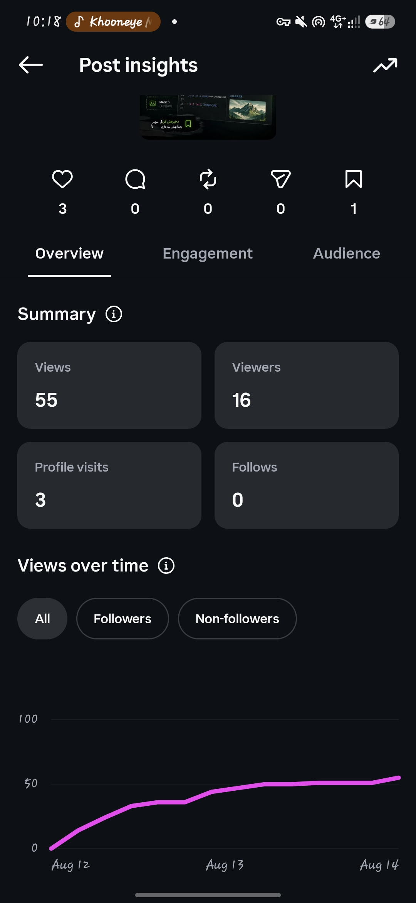
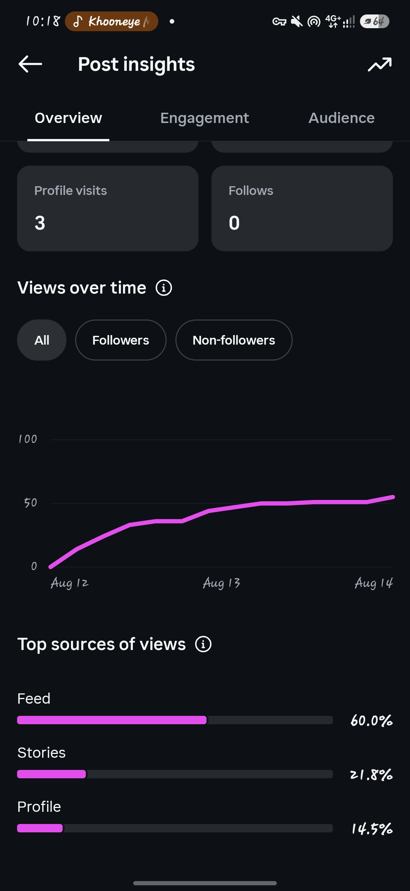
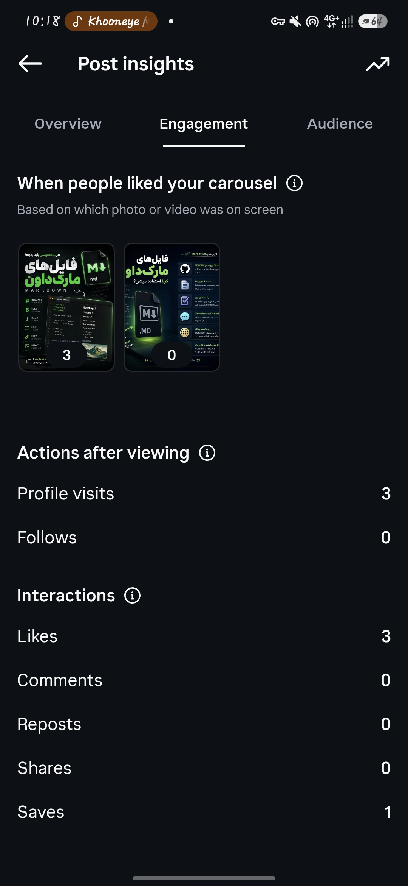
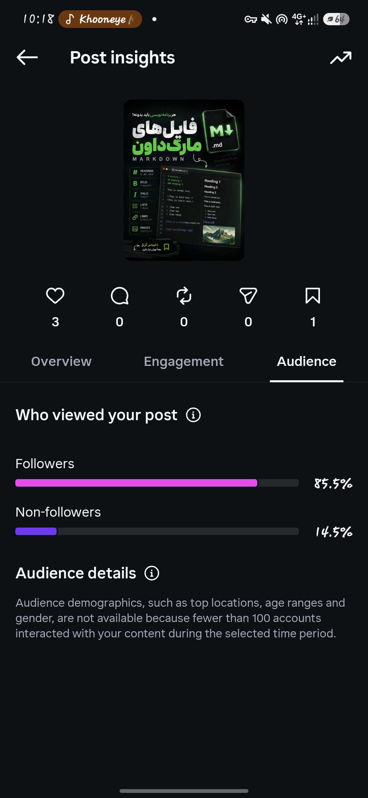

آره، الان با این سه اسکرین‌شات میشه **خیلی دقیق‌تر** درباره پست دومت قضاوت کرد. و اتفاقاً یک نکته مهم توی آمارش هست که به نظرم باید بدون استرس ببینیش.

### اول آمار واقعی پستت

بعد از حدود **۴۵ ساعت**:

* 👀 **Views: 55**
* 👤 **Viewers: 16 نفر**
* ❤️ **Likes: 3**
* 💾 **Saves: 1**
* 💬 **Comments: 0**
* 🔁 **Reposts: 0**
* ✈️ **Shares: 0**
* 👤 **Profile visits: 3**
* ➕ **Follows: 0**

و مهم‌تر:

* **85.5٪ از ویوها از Followers**
* فقط **14.5٪ از Non-followers**
* منابع ویو:

  * Feed: **60٪**
  * Stories: **21.8٪**
  * Profile: **14.5٪**

---

# اما مهم‌ترین عدد اینجاست:

### 55 Views از فقط 16 Viewers

یعنی به‌طور میانگین هر Viewer حدود:

**3.4 بار View**

داشته.

این خیلی مهمه.

یعنی 55 نفر آدم مختلف ندیدی.

**16 اکانت پست رو دیده‌اند و مجموعاً 55 بار دیده شده.**

پس اگر خودت چندین بار پست رو باز کردی، بخشی از این 55 ویو قطعاً می‌تونه از خودت باشه.

ولی یک نکته:

**نمی‌تونیم از این اسکرین‌شات بفهمیم دقیقاً چند View متعلق به خودت بوده.**

پس نمی‌تونم بگم مثلاً «30 تاش خودت بودی». چنین عددی از این اطلاعات قابل استخراج نیست.

---

# حالا سؤال اصلی: آیا این پست شکست خورده؟

### برای هدفی که تو داری: بله، عملکردش ضعیف بوده.

اما...

### ❌ این معنی رو نمی‌ده که پیجت خراب شده.

### ❌ این معنی رو نمی‌ده که اینستاگرام پیجت رو محدود کرده.

### ❌ این معنی رو نمی‌ده که محتوای Markdown بد بوده.

### ❌ این معنی رو نمی‌ده که دیگه کسی محتوای تو رو نمی‌بینه.

تو الان داری از **پست دوم یک پیج تقریباً صفر کیلومتر** انتظار رفتار یک پیج جاافتاده رو داری.

این اشتباهیه که خیلی راحت آدم رو ناامید می‌کنه.

---

# چیزی که من از این آمار می‌بینم

مشکل اصلی این پست این نیست که:

> «مردم دیدنش و دوست نداشتن.»

مشکل بزرگ‌تر اینه که:

> **اصلاً به اندازه کافی به آدم‌های جدید نمایش داده نشده.**

چرا؟

چون:

### 85.5٪ از Audience = Followers

این برای پیجی که هدفش **رشد و جذب فالوور جدید**ه، عدد خوبی نیست.

تو باید به مرور ببینی سهم Non-followers بیشتر بشه.

مثلاً در آینده ممکنه چیزی شبیه:

**Followers 20٪
Non-followers 80٪**

ببینی.

اون موقع تازه موتور Discovery پیج داره کار می‌کنه.

---

# یک نکته خیلی جالب‌تر

پستت:

**3 Like + 1 Save**

از 16 Viewer.

اگر فرض کنیم همین 16 نفر واقعاً Viewerهای یکتا باشند، این یعنی:

### حدود 18.75٪ Viewerها لایک کرده‌اند.

و:

### حدود 6.25٪ Save کرده‌اند.

برای چنین Sample کوچکی، این اعداد بد نیستند.

یعنی من از این آمار اصلاً نتیجه نمی‌گیرم که:

> «محتوای Markdown افتضاح بوده.»

اصلاً.

**Sample خیلی کوچیکه.**

16 Viewer برای قضاوت درباره کیفیت یک محتوا تقریباً هیچ داده آماری قابل اتکایی نیست.

---

# ولی چرا فقط 16 Viewer؟

اینجا به نظرم چند عامل با هم جمع شده:

### 1. پیجت تازه‌ست

این مهم‌ترین عامله.

تو هنوز Audience واقعی نداری.

وقتی یک پیج 20K فالوور داره، یک پست می‌تونه از همان ابتدا تعداد زیادی Viewer داشته باشه.

تو فعلاً داری Audience می‌سازی.

---

### 2. پست دوم Carousel بوده

این هم مهمه.

تو برای پست اولت Reel داشتی و برای پست دوم Carousel گذاشتی.

اگر هدفت الان:

> **دیده شدن توسط آدم‌های جدید + رشد سریع**

باشه، من از اینجا به بعد **Reel رو فرمت اصلی پیجت می‌کنم.**

نه اینکه Carousel رو حذف کنیم.

Carousel برای آموزش‌های عمیق‌تر، Save و Authority عالیه.

ولی برای مرحله فعلی تو:

**Reels = موتور Discovery**

**Carousels = موتور آموزش / Save / اعتبار**

---

### 3. پست رو رها کردی

این قسمت رو هم باید درست برداشت کنیم.

گفتی:

> بعد از این پست 45 ساعت هیچ پست و استوری نگذاشتم.

این کار **به‌خودی‌خود باعث نمی‌شه اینستاگرام بگه این پیج مرده و دیگه بهش Reach ندم.**

پس نگران این نباش.

اما از نظر استراتژی، تو الان در مرحله‌ای هستی که **نیاز به تعداد بیشتری آزمایش داری.**

دو پست برای فهمیدن اینکه چه چیزی جواب می‌ده، خیلی کمه.

---

# و این قسمت خیلی مهمه علی

من نمی‌خوام بهت بگم:

> «داداش ادامه بده، حتماً موفق میشی 🔥»

چون این حرف هیچ ارزشی نداره.

واقعیت اینه:

### الان ما هنوز نمی‌دونیم چه نوع محتوایی برای پیج تو جواب می‌ده.

و این **کاملاً طبیعی**ه.

تو هنوز در مرحله:

> **Testing**

هستی.

نه مرحله:

> **Scaling**

---

# بنابراین الان نباید روی View این پست قفل بشی.

من اگر جای تو بودم، اصلاً پست Markdown رو پاک نمی‌کردم.

**همین‌جا می‌مونه.**

حتی اگر 55 View داشته باشه.

چون چند ماه بعد که پیجت رشد کرد، همین پست تبدیل می‌شه به بخشی از آرشیو مسیرت.

---

# حالا از اینجا به بعد چه کار کنیم؟

من برای **TavoosCode** این مسیر رو می‌رفتم:

### Reel #1

Markdown
✅ انجام شد

### Post #2

Markdown Carousel
✅ انجام شد

### Reel #3

**Bootstrap**

همون چیزی که الان داری آماده می‌کنی.

و این بار:

**خودت داخل ویدیو باشی.**

نه معرفی طولانی.

نه:

> «سلام من علی هستم، 9 ماهه برنامه‌نویسی می‌کنم...»

اصلاً.

همون چیزی که خودت دوست داری:

> **«چرا کسی درباره این صحبت نمی‌کنه؟»**

و بعد مستقیم برو سر اصل مطلب.

---

# یک تفاوت خیلی مهم

پست Markdown به نظرم بیشتر **Search / Educational** بود.

ولی Bootstrap می‌تونه:

**Curiosity + Visual + Education**

داشته باشه.

یعنی کسی حتی اگر برنامه‌نویس هم نباشه، با دیدن:

> CSS
> 40 lines

بعد:

> Bootstrap
> چند کلاس

می‌تونه کنجکاو بشه.

این برای Reel خیلی مناسب‌تره.

---

# و یک قانون برای خودمون از اینجا به بعد

### تا قبل از حداقل 10–15 محتوای جدی، درباره موفق یا ناموفق بودن پیج قضاوت نمی‌کنیم.

یعنی مثلاً:

**پست 3 → داده**

**پست 4 → داده**

**پست 5 → داده**

...

بعد بررسی می‌کنیم:

* کدوم Hook بهتر بوده؟
* Reel یا Carousel؟
* چه موضوعی بیشتر Share شده؟
* کدوم موضوع Save بیشتری گرفته؟
* کدوم ویدیو Non-follower بیشتری آورده؟
* کدوم ویدیو Profile Visit بیشتری ایجاد کرده؟
* کدوم CTA فالو گرفته؟

اون موقع دیگه تصمیم‌گیری ما **احساسی نیست؛ داده‌محوره.**

---

## و یک چیز خیلی مهم درباره هدف اصلی تو

تو فقط نمی‌خوای:

> «فالوور جمع کنم.»

هدف نهایی تو اینه:

**محتوای برنامه‌نویسی → Audience → اعتبار → فالوور → مشتری → پروژه → درآمد → در آینده برند/شرکت**

پس حتی اگر یک Reel مثلاً 10K View بگیره ولی هیچ‌کس Profile رو باز نکنه، لزوماً بهترین محتوای تو نیست.

من ترجیح می‌دم محتوایی پیدا کنیم که:

**1000 View → 30 Profile Visit → چند Follow → یک نفر بالقوه برای پروژه**

بسازه.

این برای هدف تو خیلی ارزشمندتر از صرفاً View بالاست.

---

### جمع‌بندی خیلی صادقانه:

**55 View بعد از 45 ساعت؟** ضعیفه.

**16 Viewer؟** Sample بسیار کوچیکه.

**85.5٪ Followers / 14.5٪ Non-followers؟** برای رشد، هنوز Discovery ضعیفه.

**3 Like + 1 Save؟** با این حجم داده، بد نیست.

**آیا باید نگران پیج باشی؟** ❌ نه.

**آیا باید استراتژی رو عوض کنیم؟** ❌ نه؛ فقط باید از اینجا **Reel محورتر** بشیم.

**آیا باید پست Markdown رو پاک کنیم؟** ❌ به هیچ وجه.

**آیا 2 پست برای قضاوت درباره پیج کافیه؟** ❌ اصلاً.

و مهم‌تر از همه:

### الان وقت اینه که Reel Bootstrap رو بسازیم، نه اینکه به 55 View خیره بشیم. 😂

این دقیقاً یکی از همون جاهاییه که اگر شروع کار مدام Analytics رو چک کنی، **انرژی تولید محتوات رو می‌خوره.** تو هنوز به اندازه کافی محتوا نداری که Analytics چیز معناداری بهت بگه.
